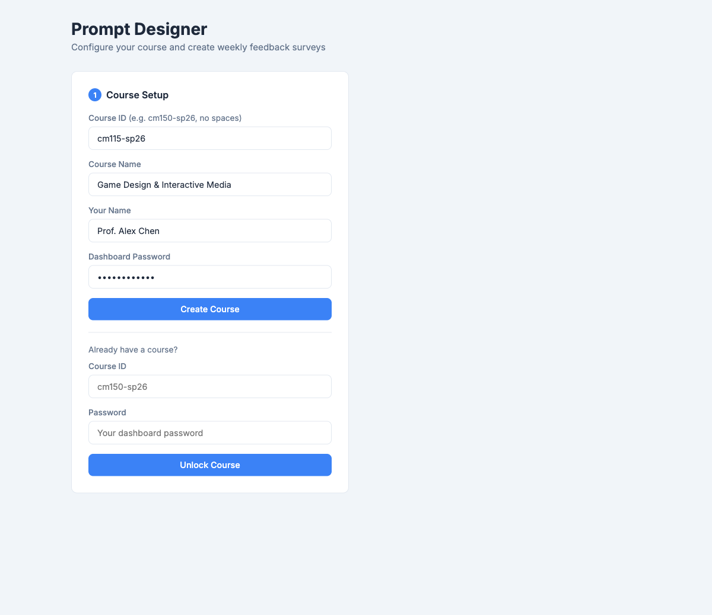
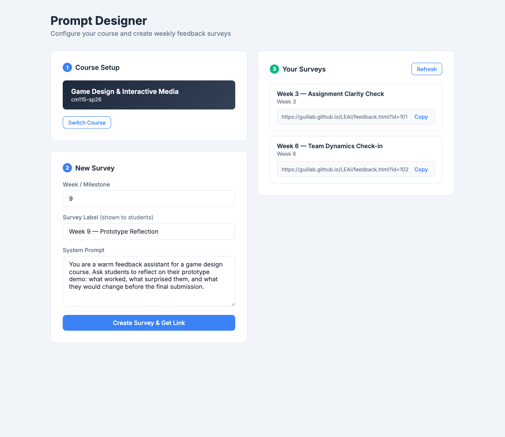
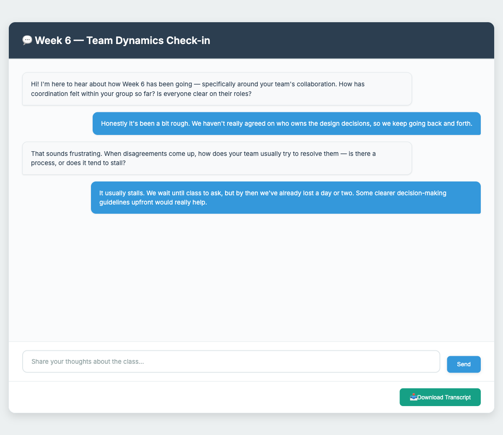
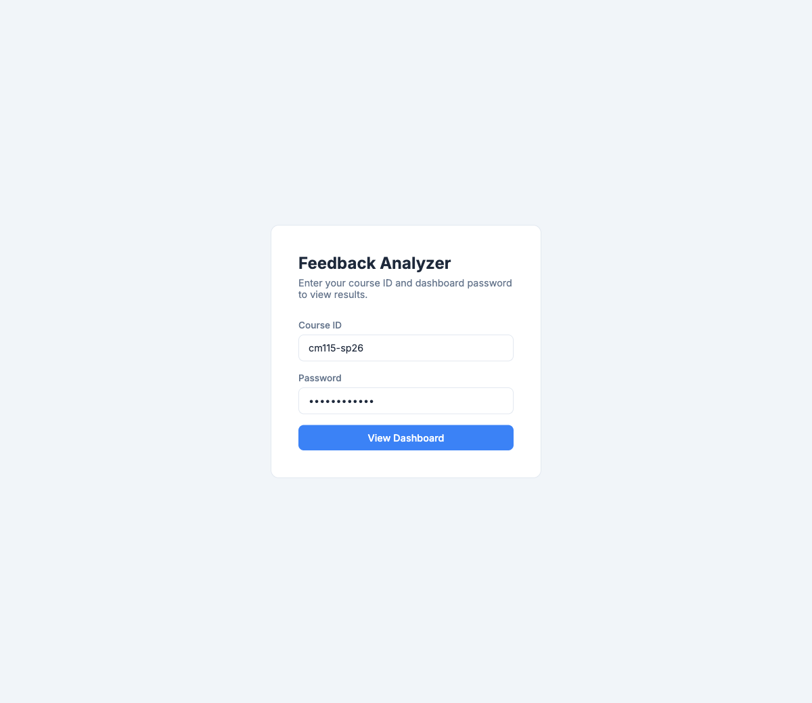
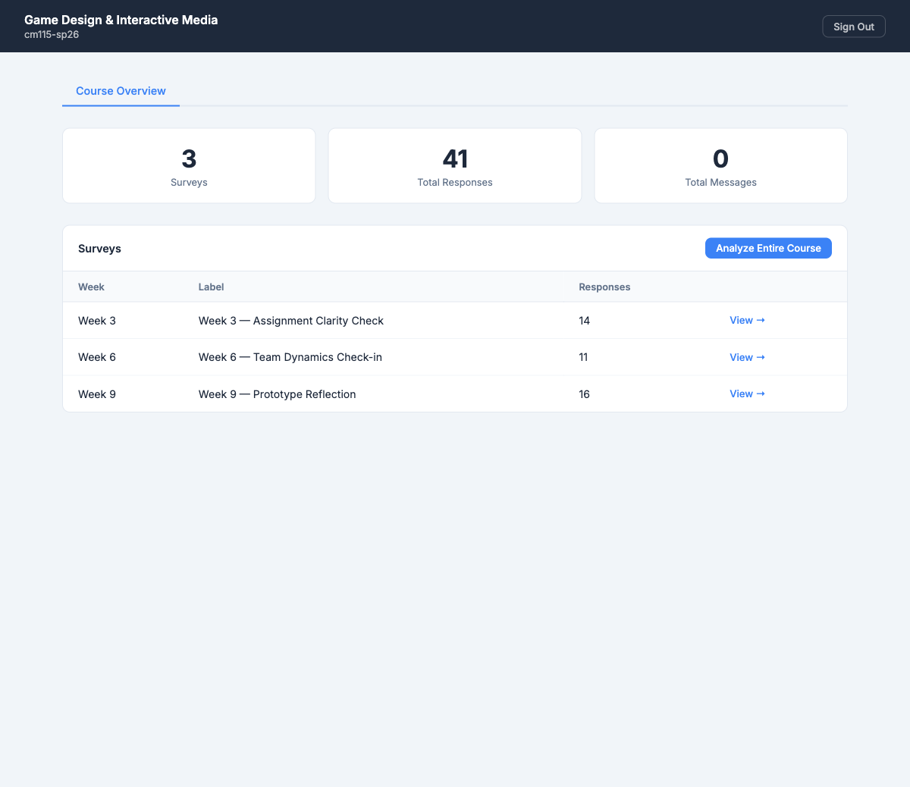
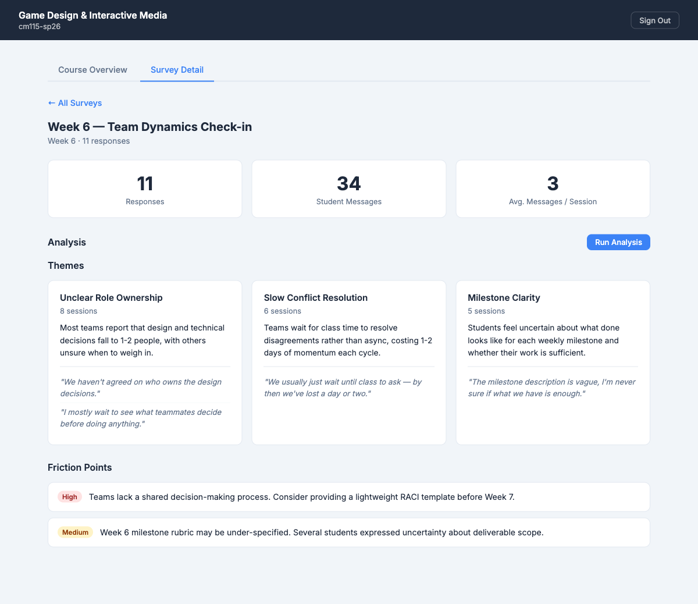

# LEAI Instructor Guide

**Learning Experience AI (LEAI)** is a course feedback infrastructure for CM instructors. It replaces end-of-quarter surveys with conversational, mid-course check-ins that you can deploy as often as you need — and gives you AI-generated summaries of what your students are actually experiencing.

---

## How It Works — 3-Minute Overview

```
You (Prompt Designer)  →  Students (FeedbackCollector)  →  You (Feedback Analyzer)
   Configure a survey       Chat with the AI                  See themes + insights
   Get a shareable link     ~5–10 min per student
```

Each "survey" is a short AI-facilitated conversation. Students follow a link, talk to the AI about the course, and you see aggregated themes and friction points — without reading 40 individual responses.

---

## Part 1: Prompt Designer

**URL:** `https://guiilab.github.io/LEAI/PromptDesigner.html`

This is where you set up your course and create surveys. You do this once per course, then return each week to create a new survey.

### Step 1 — Create your course

Fill in four fields:

| Field | Example | Notes |
|---|---|---|
| Course ID | `cm115-sp26` | Lowercase, hyphens only. This appears in all your survey links. |
| Course Name | `Game Design & Interactive Media` | Shown in the dashboard header. |
| Your Name | `Prof. Alex Chen` | Stored with the course config. |
| Dashboard Password | `feedback2026` | Protects your analytics dashboard. Share only with co-instructors or TAs. |

Click **Create Course**.

> If you're returning to a course you already set up, scroll down to **"Already have a course?"**, enter your Course ID and password, and click **Unlock Course**.



---

### Step 2 — Create a survey

Once your course is active, the **New Survey** form appears on the left:

| Field | Example | Notes |
|---|---|---|
| Week / Milestone | `6` | Used to order surveys in your dashboard. |
| Survey Label | `Week 6 — Team Dynamics Check-in` | This is shown to students as the page title. Keep it brief and descriptive. |
| System Prompt | *(see below)* | Instructions that shape how the AI conducts the conversation. |

**Writing a good system prompt** is the most important step. It defines what the AI asks about and how it follows up. A few principles:

- Be specific about the topic (e.g., "team collaboration," "assignment clarity," "prototype experience")
- Tell it the tone — "warm and conversational," "keep it short," "probe gently"
- Mention the course context so the AI doesn't ask generic questions

**Example prompt for a week 6 team check-in:**
```
You are Freddie the feedback bot and your job is to collect feedback from students taking an advanced programming class. We are trying to get feedback that can improve the lectures to help the students better understand the topics in the last few week which include: C++ - functions, variables, debugging,  loops, control flow, pointers, referencing, enums, classes/objects, strings. Project Setup - Cmake/chocolatey makefiles imgui. And design patterns such as  Bitholders/Bits. Ask questions such as "Were the concepts covered explained clearly? Can you share any specific examples where you felt stuck or uncertain about the material, if so ask them to expand on it? After gathering feedback about what they struggled to understand, Make sure to ask what they felt was explained well. Finally, be sure to ask what they are most excited about upcoming in the class. After you introduce yourself, please start with a specific question to start the conversation. Keep your responses simple and short, your purpose is to gather feedback. Do not explain topics that the student describes. If a student tells you a topic that they struggled with, ask them to reflect on what could have made the concept easier to understand. Follow up with asking about the professor's performance in teaching the student the topics. After the student is done talking about what they struggled with make sure to ask how and if the projects "Make a Logging Class" and "TicTacToe" supported their learning.
```

Click **Create Survey & Get Link**.



---

### Step 3 — Share the link

Your surveys appear on the right panel. Each one has a direct link like:

```
https://guiilab.github.io/LEAI/feedback.html?id=102
```

Click **Copy** and paste it wherever students will see it — Canvas announcement, assignment description, or a weekly email. Students don't need to log in or select anything; the link takes them directly to the right survey.

> **One link per survey, per week.** Create a new survey each week with an updated prompt — don't reuse old links, or responses will mix together in the analyzer.

---

## Part 2: FeedbackCollector (Student View)

**What students see when they open the link:**

The page opens directly to a conversation titled with your survey label. The AI sends a welcome message and begins the conversation. Students type freely — there are no multiple-choice questions.



**Key things to communicate to students:**

- Sessions are **anonymous** — no login required, session IDs are randomly generated
- A session takes **5–10 minutes**
- Students can **Download Transcript** at the end if they want a copy
- There are no right or wrong answers — the AI is listening, not grading

**Suggested Canvas announcement text:**
> This week's course check-in is open. It's a short (~5 min) AI conversation — no login needed, completely anonymous. Your input directly shapes how I adjust the course. Link: [paste link here]

---

## Part 3: Feedback Analyzer

**URL:** `https://guiilab.github.io/LEAI/FeedbackAnalyzer.html`

This is your read-only dashboard. Enter your Course ID and password to access it.



---

### Course Overview

After logging in you see all your surveys listed with response counts.



The top stats show total surveys, total responses, and total messages across the whole course. The table below lets you click into any individual survey.

**Analyze Entire Course** (top right) runs an AI analysis across all surveys — useful at mid-quarter or end of quarter to see persistent themes.

---

### Survey Detail + Analysis

Click **View →** on any survey to open its detail view.

You'll see:
- **Responses** — how many students completed the survey
- **Student Messages** — total messages sent by students (not AI)
- **Avg. Messages / Session** — a rough proxy for engagement depth

Click **Run Analysis** to generate themes and friction points from that survey's responses.



**What the analysis produces:**

**Theme cards** — 3–6 recurring topics across student sessions, each with:
- A label and session count (how many students mentioned it)
- A 1–2 sentence summary
- 1–2 representative quotes pulled directly from student messages

**Friction Points** — flagged issues with urgency levels:
- 🔴 **High** — address before your next class session
- 🟡 **Medium** — worth discussing or adjusting soon
- 🟢 **Low** — noted but not urgent

> **Minimum for a useful analysis:** aim to collect at least **8–10 responses** before running analysis. Below that, themes may not be representative. The system will still run, but treat the output as early signal rather than a full report.

---

## Weekly(or whichever frequency you prefer) Workflow (5 min/week)

```
Monday       Create a new survey in Prompt Designer, copy the link
             Post link to Canvas with a brief note

Wednesday    Check response count in Feedback Analyzer (aim for 50%+ of class)

Thursday     Run Analysis — read themes before Friday's class
             Adjust pacing, address friction points, or clarify assignments

Friday       Optional: briefly acknowledge patterns in class
             ("Several of you mentioned confusion about milestone scope — let me clarify...")
```

---

## FAQ

**Can I have multiple courses?**
Yes — each course has its own Course ID and password. Create separate courses for each section.

**Can my TA access the dashboard?**
Yes — share your Course ID and dashboard password with them. There's no separate TA login.

**Do students need a UCSC login?**
No. The link works for anyone. Students don't create accounts.

**Can I edit a survey after creating it?**
Not currently. If you need to change the prompt, create a new survey and share the new link. Old responses stay attached to the original survey.

**How many surveys should I run per quarter?**
3–4 is a reasonable target — week 3, 6, 9, and optionally week 1 (orientation) or post-milestone. More is fine, but student fatigue is real past ~4 per quarter.

**What if analysis returns something unexpected?**
The AI analysis is a starting point, not a verdict. Read a few raw sessions in the session list if something seems off. Final instructional decisions are always yours.

---

## Getting Help

Contact Jiahong Li (jli906@ucsc.edu) for technical issues, feature requests, or onboarding support.
